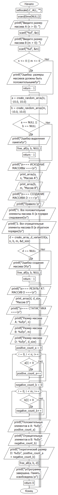
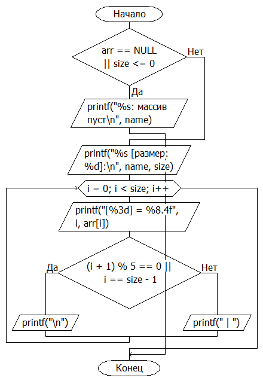
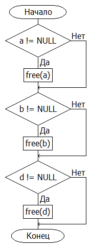
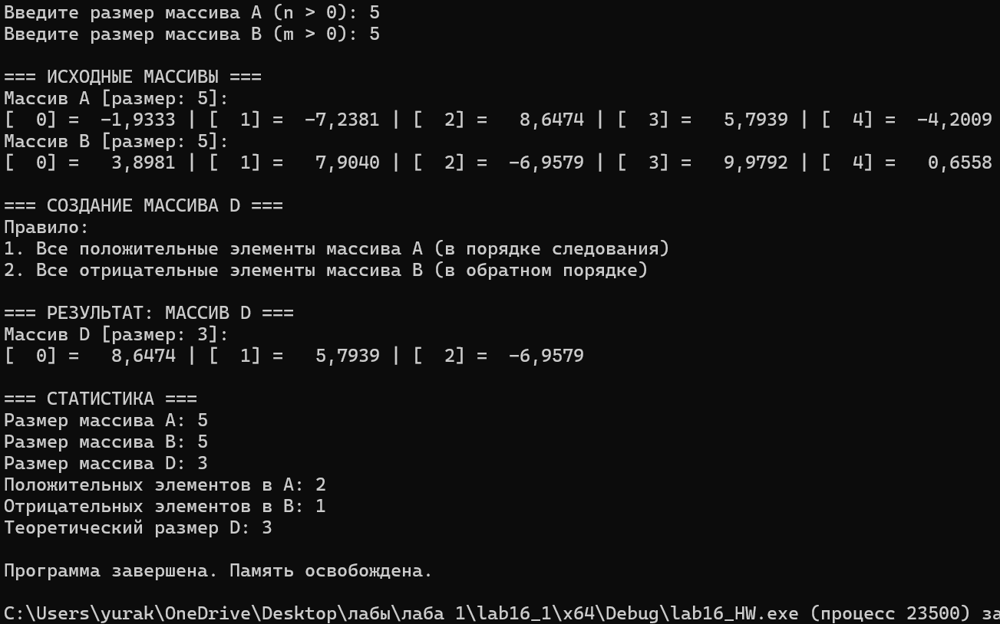

# Домашняя работа к лабораторной работе 16.
## Условия задачи:
Массив d0, d1, d2, ..., dh, приняв в качестве первых его элементов все
положительные элементы массива а0, а1, а2, ..., an с сохранением порядка их
следования, а в качестве остальных элементов все отрицательные элементы
b0, b1, b2 ..., bm в обратном порядке.

## 1. Алгоритм и блок схема:
### Алгоритм:
1. **Начало**
2.   Инициализировать переменные
3.   Ввести размеры массивов A и B
4.   создать массив D по правилам:
   - Все положительные элементы массива A (в порядке следования)
   - Все отрицательные элементы массива B (в обратном порядке)
5. Выделение памяти и создания массива
6. Освобождение памяти
7. Вывести результаты расчётов с подстановкой значений в текст.
8. **Конец**

### Блок схема





## 2. Реализация программы:
```
#define _CRT_SECURE_NO_DEPRECATE
#include <stdio.h>
#include <math.h>
#include <locale.h>

#define N 10

int main() {
    setlocale(LC_ALL, "");
    float array[N];
    int i;
    float sum = 0.0;
    float min_abs_value;
    int min_abs_index;

    printf("Введите %d элементов массива:\n", N);
    for (i = 0; i < N; i++) {
        printf("array[%d] = ", i);
        scanf("%f", &array[i]);
    }

    min_abs_value = fabs(array[0]);
    min_abs_index = 0;

    for (i = 1; i < N; i++) {
        float abs_value = fabs(array[i]);
        if (abs_value < min_abs_value) {
            min_abs_value = abs_value;
            min_abs_index = i;
        }
    }

    if (min_abs_index < N - 1) {
        for (i = min_abs_index + 1; i < N; i++) {
            sum += array[i];
        }
    }

    printf("\nРезультаты:\n");
    printf("Минимальный по модулю элемент: array[%d] = %.4f\n", min_abs_index, array[min_abs_index]);
    printf("Сумма элементов после него: %.4f\n", sum);

    return 0;
}
```
## 3. Результат работы программы

## 4. Информация о разработчике
Капичников Юрий, бИПТ-252
